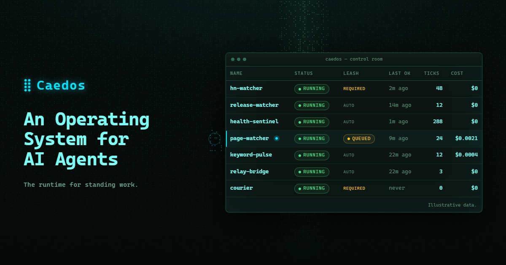

<p align="center">
  
</p>

# ⣿ Caedos

**An Operating System for AI Agents.** The runtime for standing work.

Caedos (said KAY-dos) is the OS your agent works on. Your agent installs **synths** that watch or react to the world (a page, an API, a feed, a database, an event) and then walks away. The synths keep running on Caedos. If nothing changes, they cost nothing. A model is only called when something truly needs reasoning. And nothing goes to your channels or APIs until you allow it.

> [!NOTE]
> **Caedos is closed source.** This repository holds the releases, issues and discussions. There's no source code here.

> [!IMPORTANT]
> **Caedos is out.** It's pre-1.0 and single-user. The [latest release](https://github.com/caedos-os/caedos-run/releases/latest) has the builds for Windows, macOS and Linux, and each one is smoke-tested on its own system before it's published. To hear about new ones, click **Watch → Custom → Releases**.

## Install

**macOS or Linux,** in a terminal:

```sh
curl -fsSL https://caedos.com/install.sh | sh
```

**Windows,** in PowerShell:

```powershell
irm https://caedos.com/install.ps1 | iex
```

The script downloads the build for your computer from the [latest release](https://github.com/caedos-os/caedos-run/releases/latest), checks it against the release's checksums, and puts `caedos` in `~/.local/bin`, or on Windows in `%LOCALAPPDATA%\Programs\Caedos`, which it adds to your PATH. It needs no admin rights, and changes nothing else. Read it first if you like: [install.sh](https://caedos.com/install.sh), [install.ps1](https://caedos.com/install.ps1). Then run `caedos start`, and [caedos.com/start](https://caedos.com/start) walks you through your first synth.

**Or download it** from the [latest release](https://github.com/caedos-os/caedos-run/releases/latest). Its notes say which file is yours, and how to check a download against the signed checksums.

- **Windows:** unzip it and double-click `caedos.exe`, or run `.\caedos.exe start` in a terminal.
- **Linux:** unpack it, open a terminal in that folder and run `./caedos start`.
- **Mac:** download it with `curl`, not a browser. Apple hasn't notarized Caedos yet, so macOS blocks it when a browser downloaded it, but not when `curl` did:

  ```sh
  curl -fLO https://github.com/caedos-os/caedos-run/releases/latest/download/caedos-darwin-arm64.tar.gz
  tar -xzf caedos-darwin-arm64.tar.gz && cd caedos-darwin-arm64 && ./caedos start
  ```

  On a Mac with an Intel processor, use `caedos-darwin-x64` instead.

Caedos prints the control room's address, **http://localhost:2233**, and the line that connects Claude Code, with the right path for your computer:

```sh
claude mcp add --scope user caedos -- caedos mcp
```

Any other MCP client: the command `caedos` (its full path if it isn't on your PATH), with the argument `mcp`. To keep Caedos running after you close the terminal, run `caedos service install`: it starts Caedos when you sign in.

> [!NOTE]
> **The Mac and Windows builds are beta.** The Mac build isn't notarized yet, as above. The Windows build isn't code-signed yet: where Smart App Control is on, Windows blocks it, and a browser download shows a SmartScreen warning; the PowerShell script doesn't.

## The problem

**You keep asking. It keeps forgetting.** You ask your assistant. It looks, it answers, and the moment the chat closes, the work stops. So every morning you ask again: did the upstream ship a release? Did the status page go red? Did anyone mention you on Hacker News?

The usual workarounds, and what each one costs:

| Workaround | What happens | Costs |
|---|---|---|
| **Keep asking.** | You become the scheduler. Anything that changes between chats waits until you think to ask. | your attention |
| **Put a model on a timer.** | It reads the same unchanged page every hour and tells you nothing happened. | a model call per check |
| **Hand it to an agent.** | Give it a webhook and a loop and it acts on its own. The first you hear of a bad idea is from whoever received it. | a send you never saw |

## The solution

**Ask once. Leave. It keeps watching.** The same checks, without the asking.

1. **Ask.** Tell your assistant what to keep an eye on. In Claude Code or any MCP client, that's one ordinary sentence.
2. **It writes a synth.** A small program, usually 30 to 60 lines of config: where to look, what counts as a change, when to think, what to do. Data, not generated code.
3. **Shadow.** One real run against the real world, with every action muted. You see what it read, what it would remember and what it would have sent.
4. **Deploy, leashed.** It becomes a process and starts ticking. Anything that would touch the outside world waits in your approval queue.
5. **Allow.** When you trust it, press **Allow** in the control room. That's a human act. It isn't one of your AI's tools.
6. **Leave.** Close the chat. The process keeps its schedule, its memory and its budget. Every tick leaves a trace.

## Who does what

**Your AI writes. Caedos runs. You decide.** Caedos splits standing work into the part a model is good at (writing the synth) and the part it isn't (running it faithfully and cheaply, tick after tick).

| | Who | What they do |
|---|---|---|
| **01 · Authoring** | Your AI | In Claude Code or any MCP client, it writes the synth, shadows it, deploys it, reads traces and patches from evidence. Then it leaves. |
| **02 · Running on Caedos** | Caedos | Once deployed, the synth runs as a process. Caedos fires it on its trigger, walks 6 phases per tick, records everything and repairs what it can. |
| **03 · Approval** | You | You allow side effects, approve or reject queued actions, read journals and set policy. |

*Allow is a button in your control room. It isn't one of your AI's tools.*

## Most ticks are silent. That's the design.

A tick is one run of a process. It starts whenever the trigger fires: on a schedule, when a webhook arrives, when a signal lands on the Relay, or when you press Run. Every tick walks the same 6 phases:

```
LOAD → OBSERVE → FILTER → REASON → ACT → SAVE
```

A deterministic gate in the middle decides whether a model is needed. If nothing changed, no model is called: the tick costs nothing and leaves one line in the journal that says `idle`.

**A tick that sees no change makes zero model calls.**

## Built for work you'd rather not think about

- **Know what it would do before it does it.** Shadow runs one real tick with every action muted: what it read, what it would remember, what it would send.
- **Every send waits for your OK.** Processes that can touch the world deploy leashed. Outbound actions queue for one-tap approval until you Allow.
- **A bill you can predict.** Deterministic checks are free. Model calls get a daily dollar budget, a hard cap, and a monthly estimate before you deploy.
- **Every tick, accounted for.** What caused it, what it saw, what it cost, what it did, which version ran. Replay any tick against an edited config.
- **Synths that talk to each other.** Synths run as processes that publish and subscribe on the Relay. One watches, one decides, one sends, each with its own leash.
- **Failure you can read.** Repeated failures halt the process. Stalls get a bounded repair, proven before it's adopted. When Caedos gives up, you get an autopsy, not a red dot.
- **Brings your tools.** MCP servers over HTTP or stdio, REST APIs, RSS, web pages, webhooks. Credentials stay in an encrypted vault and never appear in a trace.
- **Yours to leave.** One SQLite file on your machine, your own model key, and a workspace export any time (secrets excluded).

**Models:** Anthropic (default), OpenAI and xAI. Pick a tier per process (economy, standard, premium), and change models in Settings without restarting.

## Where it fits

**Not an agent framework. Not a Zap.** Caedos is built for work that repeats: watch something, notice a change, maybe think, maybe send.

| | How they work | What Caedos does |
|---|---|---|
| **Agent frameworks** | A model decides what to do next, every step of every run. | Your AI writes the synth once. A deterministic engine runs it the same way every time and asks a model only when something changed. |
| **Zapier and n8n** | You draw the workflow yourself, step by step, and it runs what you drew. | You describe the job and your AI writes the synth. Every send waits for your Allow. |
| **Scheduled chat tasks** | A model is called on every run, whether anything changed or not. | A check that finds nothing makes no model call and costs nothing. The model is asked only when something changed. |
| **Cron and a script** | Your script runs on a timer. Memory, budgets, approvals and logs are yours to build. | Memory, a budget, a leash, a trace for every tick and a control room come built in. |

Already on n8n or Zapier? The courier blueprint hands approved drafts to your webhook.

### What Caedos isn't

- **Not an agent loop.** No model decides what to do next at runtime. The synth does.
- **Not code generation at runtime.** Synths are data interpreted by one engine.
- **Not hosted.** It runs where you run it.
- **Not multi-user yet.** One operator per install.

## Blueprints

**Start from something that already works.** 9 blueprints ship with Caedos and are validated in CI. Install one from the control room (**Blueprints → Shadow → Deploy**), or ask your AI to.

| Blueprint | What it does | Model calls |
|---|---|---|
| Price watcher | Alerts the moment a price on a page changes. | None |
| API health sentinel | Tells you once when a status changes, and again when it recovers. | None |
| GitHub release watcher | New release on a repo you depend on. | None |
| HN keyword watcher | New Hacker News stories that mention your word. | None |
| Page change watcher | Only thinks when the page actually changed. | Only on change, ≤ $0.05/day |
| Daily HN brief | Three lines on what mattered, once a day. | 1 a day: about $0.02 a month, capped at $0.30 |
| Keyword pulse analyst | Notices when chatter shifts, and says why. | Only on change, ≤ $0.02/day |
| Relay bridge | Team glue: forwards findings to a digest topic. | None |
| Outbound courier | Hands approved drafts to your n8n or Zapier webhook. | None |

## Security, plainly

**Local by default. Leashed by default. Honest about the rest.**

- Binds to `127.0.0.1` unless you say otherwise, and warns loudly if you do.
- Secrets are encrypted at rest (AES-256-GCM), resolved only inside the step that uses them, and never written to a trace.
- No telemetry, no license check and no update check. The only calls out go to your model provider, the places your processes are told to reach, and the MCP servers you connect.
- Allow isn't one of your AI's tools. But an AI that can run commands on your computer can do anything you can, including Allow.
- **Caedos is single-user and has no authentication yet.** Don't expose it to a network you don't trust.
- Every release's checksums are signed with the Caedos release key. The release notes show the key and how to check a download.

Found a vulnerability? Email **support@caedos.com** rather than opening a public issue. Reports are acknowledged within 3 business days.

## Pricing

**Free to run. Fair to use. Your model bill is yours.**

| Plan | Price | For |
|---|---|---|
| **Free** | $0 | Caedos on your machine, for personal use and for work, at a company of any size. Every feature, and no limit on synths. |
| **Cloud** | Not built yet | The same Caedos, kept running for you, for work that has to stay up while your computer sleeps. It gets built when enough people ask: tell us at support@caedos.com. |

You bring your own model key and your provider bills you directly; Caedos takes no cut.

**The license:** Caedos is free for personal use and for work under the **Elastic License 2.0**. You may not offer it to others as a hosted or managed service. Each release package includes the full license and `THIRD_PARTY_NOTICES`. Your synths, configs and data are yours.

## Community

- **Questions and ideas:** [Discussions](https://github.com/orgs/caedos-os/discussions)
- **Bugs:** [Issues](../../issues)
- **Chat:** [Discord](https://discord.gg/fMsYbjvvC9)

---

© 2026 Ross Walpole. Free for personal use and for work under the Elastic License 2.0.
